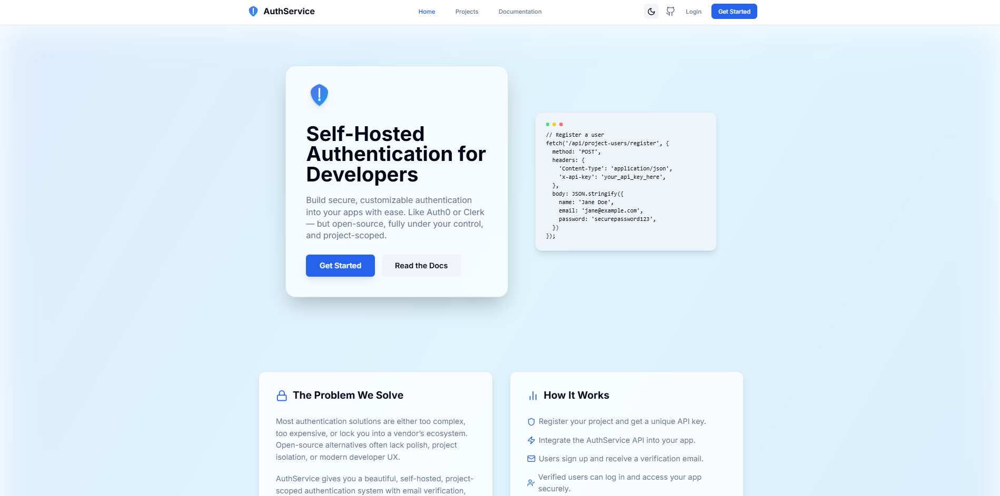
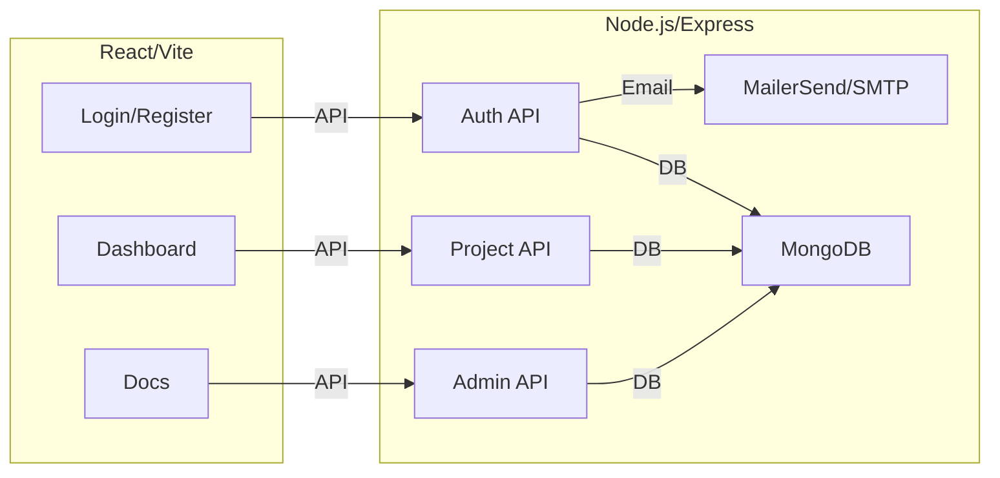

<h1 align="center">Auth0-Clone: Self-Hosted Authentication Service</h1>


<p align="center">
  
</p>

<p align="center">
  <b>Modern, open-source authentication for developers.</b><br/>
  Project-scoped user management, email verification, admin dashboard, analytics, and more.<br/>
  <i>Built with Node.js/Express & React/Vite</i>
</p>

<p align="center">
  
</p>

<p align="center">
  <a href="#features"></a>
  <a href="#quick-start"></a>
  <a href="#license"></a>
  
  
  
</p>

---

##  Features

- 🏢 **Project-Scoped User Management**: Each project has its own isolated user base, API key, and analytics.
- 📧 **Email Verification**: Secure signups with built-in email verification (MailerSend or SMTP).
- 🛡️ **Admin Dashboard & Analytics**: Manage users, resend verification, and view project stats.
- 🎨 **Modern UI/UX**: Beautiful, responsive, and dark-mode ready for devs and users.
- 🌐 **Hybrid CORS**: Public/protected API endpoints for SaaS or embedded use.
- 🐳 **Production-Ready Dockerfile**: Easy deployment to Railway, Render, or your own server.

---

##  Architecture



---

##  Environment Variables

**Where to put your `.env` files:**

- **Backend:** Place `.env` in `/backend`.
  - Example:
    ```env
    MONGO_URI=your_mongodb_uri
    JWT_SECRET=your_jwt_secret
    FRONTEND_URL=https://your-frontend.com
    MAILERSEND_API_KEY=your_mailersend_api_key
    FROM_EMAIL=your_verified_sender@yourdomain.com
    ```
- **Frontend:** Place `.env` in `/frontend`.
  - Example:
    ```env
    VITE_API_BASE_URL=https://your-backend.com/api
    ```
- **Never commit your `.env` files to GitHub!**

---

##  Quick Start

```sh
# Backend
cd backend
cp .env.example .env  # Fill in your secrets
npm install
npm start

# Frontend
cd ../frontend
cp .env.example .env   # Set VITE_API_BASE_URL
npm install
npm run dev
```

---

##  Production
- See the Dockerfile in `/backend` for deployment.
- Set all secrets in Railway/your host.
- Frontend: build with `npm run build` and deploy `dist/` to Vercel/Netlify/etc.

---

##  Contributors
<p>
  <a href="https://github.com/rusilkoirala"></a>
  <!-- Add more contributors here -->
</p>

---

##  Contributing

We welcome contributions! To get started:
1. Fork the repository
2. Create your feature branch (`git checkout -b feature/YourFeature`)
3. Commit your changes (`git commit -m 'Add your feature'`)
4. Push to your branch (`git push origin feature/YourFeature`)
5. Open a Pull Request

---

##  Documentation
- [Features & API Reference](#features)
- [Docs UI](https://github.com/rusilkoirala/auth-service)

---

##  License

This project is licensed under the MIT License. See the [LICENSE](LICENSE) file for details.
